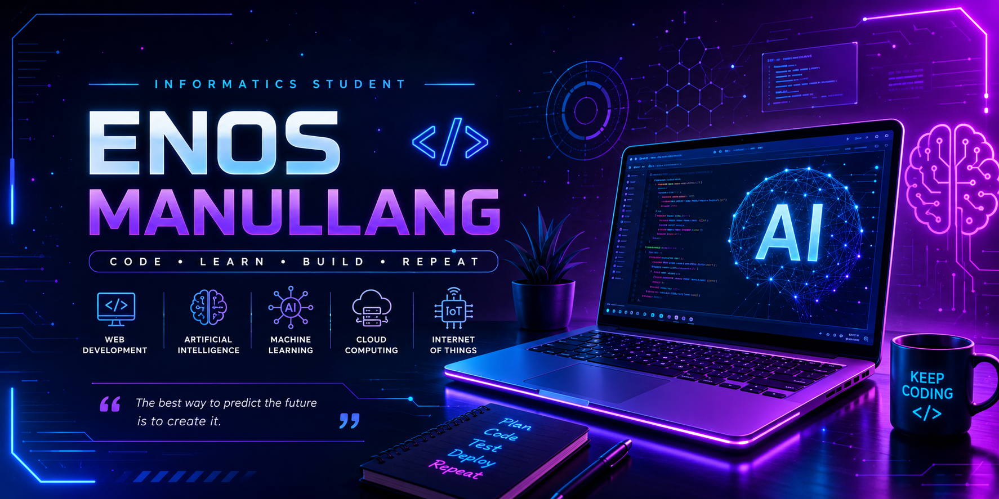

<!-- Banner -->

  

<!-- Typing Animation -->

  

---

<!-- ========================================= -->
<!-- ABOUT ME -->
<!-- ========================================= -->

<h2 align="center">👨‍💻 About Me</h2>

Hi there! 👋 I'm <b>Enos Manullang</b>, an <b>Informatics Student</b> who is passionate about
building modern web applications, exploring Artificial Intelligence,
and continuously learning new technologies.

I enjoy turning ideas into real-world solutions through clean, efficient,
and maintainable code. My interests include Web Development,
Machine Learning, Database Systems, and IoT.

 

### 🚀 Current Focus

- 🌐 Building responsive web applications
- 🤖 Learning Artificial Intelligence & Machine Learning
- 💻 Improving Full Stack Development skills
- 📚 Exploring Cloud Computing
- 🔥 Building useful portfolio projects
- 🎯 Learning something new every day

### 🎓 Education

- 🎓 Informatics Student
- 🏫 Universitas Potensi Utama
- 📍 Medan, Indonesia

### 💡 Interests

- 🌐 Web Development
- 🤖 Artificial Intelligence
- 🧠 Machine Learning
- 📱 Mobile Development
- ☁️ Cloud Computing
- 📡 Internet of Things (IoT)

 

---

<h2 align="center">💻 Tech Stack</h2>

---

<h2 align="center">📈 Currently Learning</h2>

🟢 Artificial Intelligence  
🟢 Machine Learning  
🟢 Deep Learning  
🟢 Cloud Computing  
🟢 Laravel Framework  
🟢 Internet of Things (IoT)

---

<h2 align="center">🎯 Goals 2026</h2>

- ✅ Build more real-world projects
- ✅ Master Full Stack Web Development
- ✅ Learn Machine Learning & Deep Learning
- ✅ Contribute to Open Source
- ✅ Improve Problem Solving Skills
- ✅ Create a Professional Portfolio

<!-- GitHub Analytics -->

<h2 align="center">📊 GitHub Analytics</h2>

  

  

---

<!-- GitHub Streak -->

<h2 align="center">🔥 GitHub Streak</h2>

  

---

<!-- Contribution Graph -->

<h2 align="center">📈 Contribution Graph</h2>

  

---

<!-- Profile Summary -->

<h2 align="center">📌 Profile Summary</h2>

<!-- ========================================= -->
<!-- FEATURED PROJECTS -->
<!-- ========================================= -->

<h2 align="center">🚀 Featured Projects</h2>

| Project | Description | Tech |
|:--------:|-------------|------|
| 🌐 **Smart Event Campus** | A web-based campus event management system with admin dashboard, authentication, and CRUD features. | PHP • MySQL • Bootstrap |
| 🤖 **Malaria Classification** | Image classification project to identify malaria parasite species using Deep Learning. | Python • TensorFlow • Google Colab |
| 🌡️ **IoT Monitoring System** | IoT-based monitoring system for collecting and visualizing sensor data in real time. | ESP8266 • ThingSpeak • Arduino |
| 💻 **Personal Portfolio Website** | Responsive personal portfolio website showcasing projects and skills. | HTML • CSS • JavaScript |

---

<h2 align="center">📂 Repository Highlights</h2>

🔹 Clean Code

🔹 Responsive Design

🔹 Database Management

🔹 REST API Learning

🔹 Object-Oriented Programming

🔹 Artificial Intelligence

🔹 Machine Learning

🔹 Internet of Things

---

<!-- ========================================= -->
<!-- CERTIFICATIONS -->
<!-- ========================================= -->

<h2 align="center">🏅 Certifications</h2>

> 🚧 This section will be updated as I earn new certifications.

- 📜 Dicoding - *(Coming Soon)*
- 📜 Google Career Certificates - *(Coming Soon)*
- 📜 Microsoft Learn - *(Coming Soon)*
- 📜 Cisco Networking Academy - *(Coming Soon)*

---

<!-- ========================================= -->
<!-- CONNECT -->
<!-- ========================================= -->

<h2 align="center">🌐 Connect With Me</h2>

<!-- Ganti username jika sudah punya LinkedIn -->

<!-- Ganti username jika ingin menampilkan Instagram -->

---

<h2 align="center">👀 Profile Views</h2>

---

<h2 align="center">💬 Favorite Quote</h2>

<i>

"Success doesn't come from what you do occasionally.  
It comes from what you do consistently."

</i>

---

<h2 align="center">✨ Thanks for Visiting!</h2>

Thank you for visiting my GitHub profile.

If you like my work, don't forget to ⭐ my repositories.

Let's learn, build, and grow together! 🚀

---

<h2 align="center">🐍 Snake Contribution</h2>

  <picture>
    <source media="(prefers-color-scheme: dark)"
      srcset="https://raw.githubusercontent.com/Aethelgard-has/Aethelgard-has/output/github-contribution-grid-snake-dark.svg">

    <source media="(prefers-color-scheme: light)"
      srcset="https://raw.githubusercontent.com/Aethelgard-has/Aethelgard-has/output/github-contribution-grid-snake.svg">

    
  </picture>

---

### ⭐ Happy Coding! ⭐

Made with ❤️ by **Enos Manullang**

